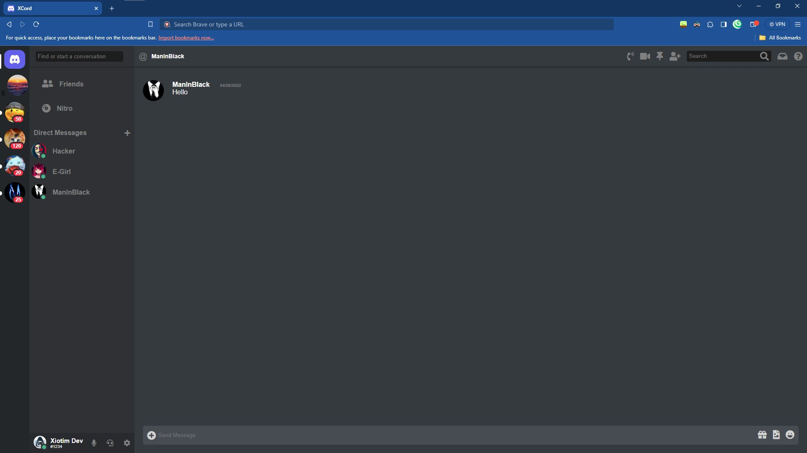
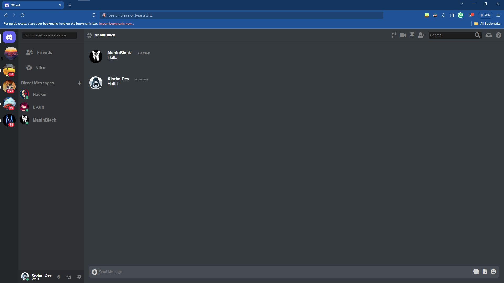

# XCord

A clone of the Discord chat websit. This is a back-up for my hard-disk just in-case it becomes corrupt - and a point of  comparison for you.

The assets can be found [here](https://github.com/JawherBalti/discord-clone)

**(Thanks DevOur Code!)**


## Acknowledgements

 - Tutorial by: [DevOur Code](https://www.youtube.com/@DevOurCode94)
 - Huge shoutout, to my youngest project as of writing this: [XDT-XChat](https://github.com/l-xdt/xchat/)
- A huge help in this project:  [DiffChecker](https://www.diffchecker.com/)


## Authors

- [LeidensSchaft Xiotim-Development Team](https://www.github.com/l-xdt/)
- [Alvin Maranx, II ツ (Avun)](https://www.github.com/avun-ai/)
- [DevOur Code](https://www.youtube.com/@DevOurCode94)
## Demo

There is a demo on this project! And I'm not being indirect, here is the link, click: [here](https://l-xdt.github.io/xcord/)


## Features

- Change the profile pictures of who you want to see.

- Change colors of the UI.

- Cross-platform Support.

- Change the avatar photos.

- Change the server photos.

- **PS:** Still not a lot to work with here, so you might have to tinker a little.


## Screenshots





**Written in Plain HTML, CSS, and JavaScript. The rest you have to figure out on your own**


## Run Locally

Clone the project and Run it on XAMPP.

(**PS:** I would recommend, an alternative domain from localhost, to add some more reality to the effect.)

```bash
  git clone https://github.com/l-xdt/xcor
```

Go to the project directory

```bash
  cd xcord
```

Install XAMPP (via Chocalatey, if you dont have it.)

```bash
  chocalatey install xampp
```

Start the server

```bash
  [Directory]/[ServerName]/apache-start.bat
```

**PS:** If you trust your web skills, here is a manual on how to self- host a domain: [here](https://www.youtube.com/watch?v=_eQGAJVtRCs) (by Soeng Souy)


## Roadmap

- Additional browser support

- Change the server avatars.

- Change avatars.

- Change FavIcon

- This is all written in **Vanilla HTML, CSS and JavaScript**

- It is influenced by our signature: **X**


## Support

For support, reach out to us via either of our emails:
[this one](mailto:trowesigames@gmail.com)  or 
[this one](
mailto:leidenschaft.tech@hotmail.com) or join our Discord Group: which is not up as of writing this readMe.

## Feedback

This still applies to feedback aswell, Whether you want to give us positive words or negative ones, send away. (but please send only constructive- critisism) .

Send away [here](mailto:trowesigames@gmail.com) or
[here](mailto:leidenschaft.tech@hotmail.com).


## FAQ

**Now, my fav, FAQ!**

#### Can I modify this is anyway to fit my needs.

Exactly! That is what we made this repository for. This for you to experiment with.

#### Can I host this, if I can how?

You can, with my real favourite, XAMPP! I have explained it a thousand times, from all those read-mes. But I will explain again.

It works by using the IP that works with every Windows, Linux (and some select macOS) computers:
127.0.0.1 used to host your little websites.

You can get started using this tutorial by: MainlyWebStuff, click [here](https://www.youtube.com/watch?v=LzucEZh4_no). And for a new domain instead of localhost, click [here](https://www.youtube.com/watch?v=_eQGAJVtRCs) for a tutorial by: Soeng Souy.


## Used By

This project is used by the following companies:

- LeidenSchaft-Xiotim Accquistions (Limited)

- XDT-Studium

- Xiotim Development Team [Limited] (XDT)

- XDT-noHesi


## Related

Here are some related projects:

- [XioTok](https://github.com/l-xdt/xiotok/)

- [noHesi](https://github.com/l-xdt/no-hesi/)

- [Xirox](https://github.com/l-xdt/xirox/)

- [Studium](https://github.com/l-xdt/studium/)

- [XioTim](https://github.com/l-xdt/xiotim/)

- [XioTube](https://github.com/l-xdt/xiotube/)

- [xSocial](https://github.com/l-xdt/xSocial/)

- [XGram](https://github.com/l-xdt/xgram/)

- [XChat](https://github.com/l-xdt/xchat/)

## Documentation

- I cannot tell you all about the documentation, so please check out the tutorial linked below: 

- [Discord Clone](https://www.youtube.com/watch?v=zJbhxJeVfRU) by DevOur Code (on YouTube)


## API Reference

As earlier mentioned,there is no APIs used and/or any Frameworks, This is just a very base-level project, If used, I will update this readMe.   